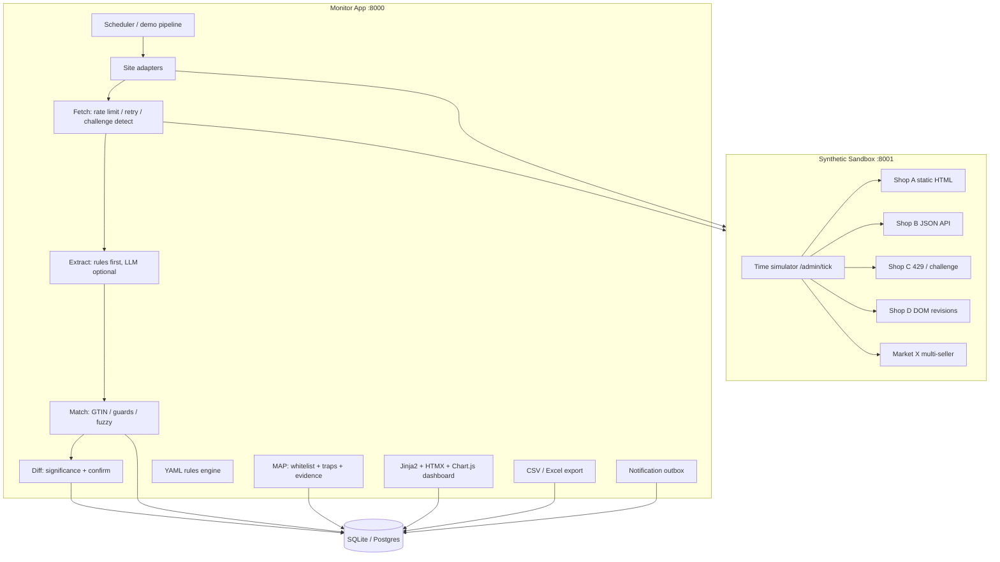
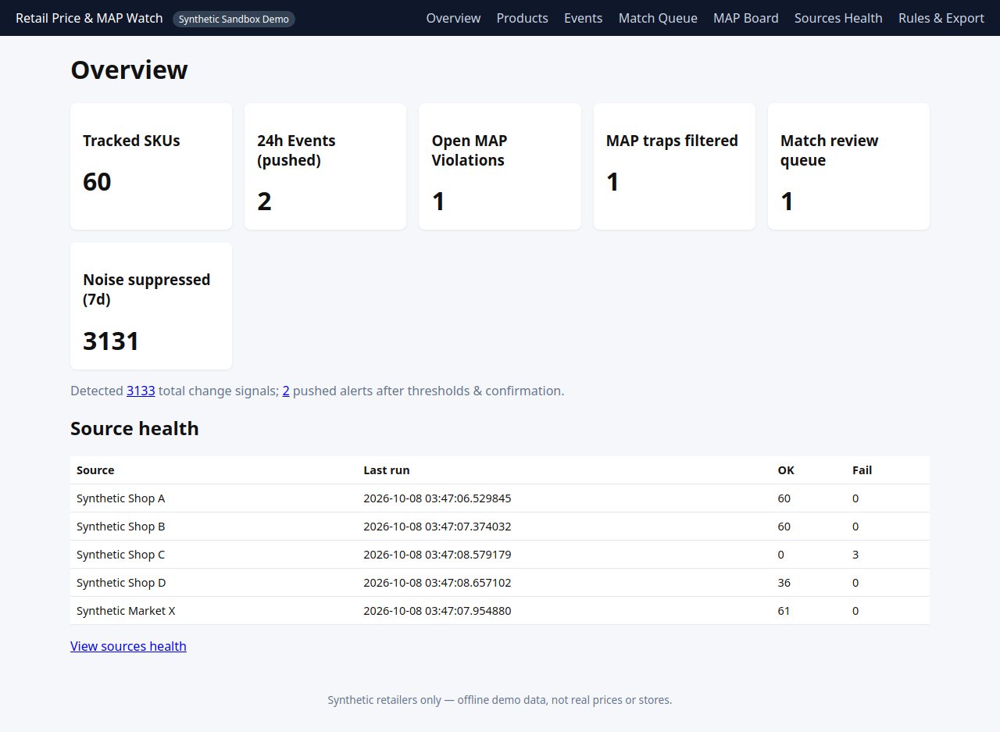
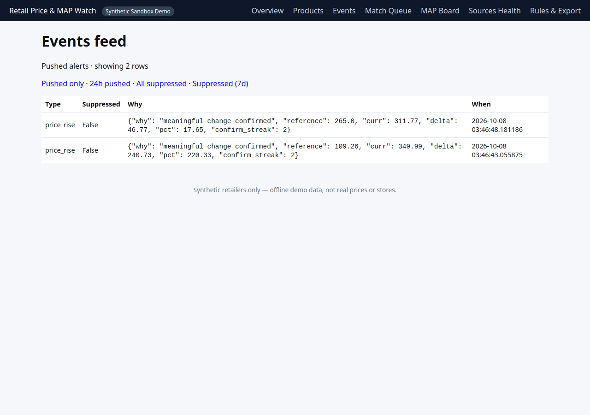
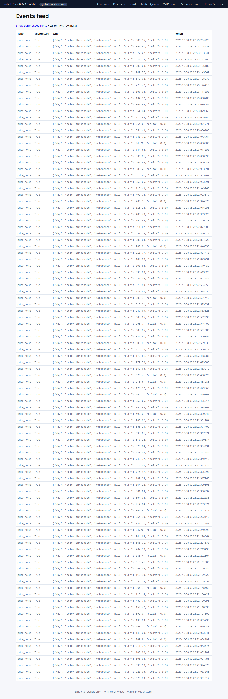
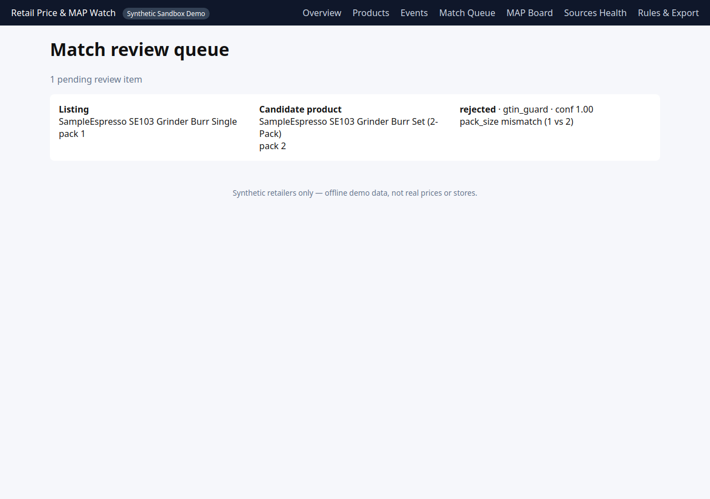
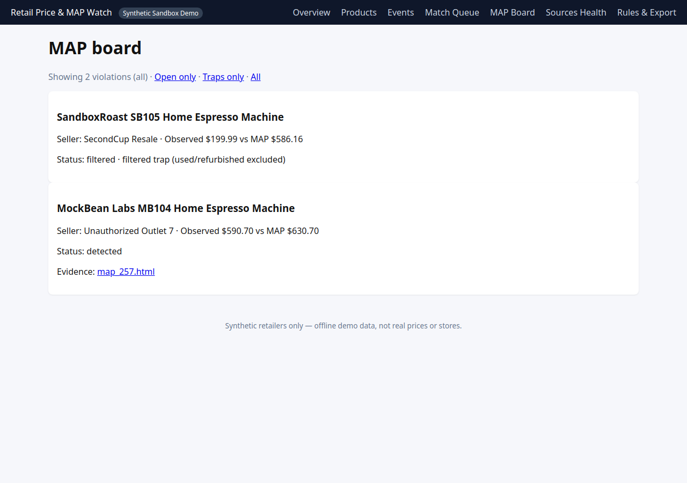
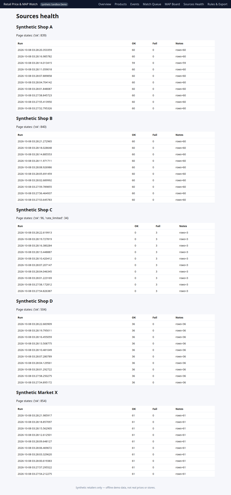
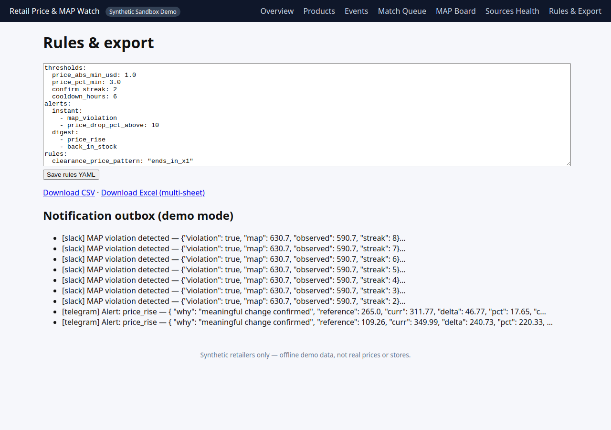
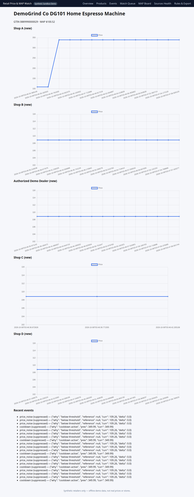

# Retail Price & MAP Watch

> **Retail Price & MAP Watch — competitor monitoring that only alerts you when it matters**  
> Monitors 5 retailers/marketplaces on a schedule, matches the same product across sites (GTIN/MPN + fuzzy title with pack-size/variant guards, low-confidence matches go to a review queue), stores full price & stock history, and fires alerts only on meaningful events (drop > X%, out-of-stock, new/delisted, MAP breach confirmed twice). Detects rate limits, challenge pages and layout changes instead of producing false alerts, and notifies you when a source breaks. MAP violations come with screenshot evidence and seller identity; used/bundle/shipping-only cases are filtered out. Exports to CSV, multi-sheet Excel and Google Sheets; alerts via Telegram, Slack or email. Python · FastAPI · Playwright · SQLite/Postgres · Docker. Runs fully offline with a bundled sandbox so you can try it in 2 minutes.

All retailers, products, prices, and sellers in this repository are **synthetic sandbox data** for portfolio demonstration. The app does not scrape real stores in the demo.

---

## Problem it solves

| Client pain (from Upwork / community research) | How this demo addresses it |
|---|---|
| Alert noise (“200 alerts because price moved 2¢”) | Absolute/percent thresholds, **two-observation confirmation**, cooldowns, and a visible “noise suppressed” counter with reasons |
| Cross-site matching errors (single unit vs 2-pack) | GTIN/MPN first, fuzzy title with **attribute guards**; conflicts land in **Match Review Queue** |
| Blockers / challenge pages / silent bad parses | Fetch layer marks `rate_limited` / `challenge` / `parse_fail`; bad rows **do not** drive price diffs; **Sources Health** panel |
| MAP false positives (used, shipping-inclusive) | MAP module filters **used/refurb**, bundles, and **shipping traps**; real breaches need consecutive confirmations + evidence HTML |
| Deliver to Sheets/Excel + low ops | CSV + multi-sheet Excel export, notification **Outbox** (Telegram/Slack/SMTP hooks), Docker one-liner |

---

## Architecture



**Layout**

```
docker-compose
 ├─ sandbox/     FastAPI fake shops + time simulator (8001)
 └─ app/         FastAPI monitor + dashboard (8000)
scripts/demo.py   14-day scripted run (tick + ingest)
tests/            Core logic unit tests
docs/screenshots/ Dashboard captures (from Playwright)
data/demo_readonly.db  Bundled DB for Vercel read-only demo
```

---

## Run in ~2 minutes

### Docker (recommended)

```bash
docker compose up -d --build
make demo          # simulates 14 sandbox days + ingests observations
open http://localhost:8000
```

### Without Docker (venv + one command)

Terminal A — sandbox:

```bash
pip install -r requirements.txt
cd sandbox && uvicorn main:app --port 8001
```

Terminal B — demo + dashboard:

```bash
pip install -r requirements.txt
playwright install chromium   # optional; MAP HTML evidence stubs work without it
make demo-local
cd app && DATABASE_URL=sqlite:///../data/app.db uvicorn main:app --port 8000
```

Then open `http://localhost:8000`.

### Demo script output (from a fresh run in this repo)

After `make demo-local`, `data/demo_summary.json` contains:

```json
{
  "events_total": 3133,
  "events_pushed": 2,
  "events_suppressed": 3131,
  "map_detected": 1,
  "map_traps_filtered": 1,
  "match_queue": 1,
  "match_rejected": 1
}
```

Interpretation: thousands of raw movements collapsed to **2 pushed alerts**, with pack-size guard rejections and MAP traps visible on their boards.

---

## Dashboard pages

| Page | Path | Screenshot |
|---|---|---|
| Overview | `/` |  |
| Events (pushed) | `/events` |  |
| Events (+ suppressed noise) | `/events?show_suppressed=1` |  |
| Match Review Queue | `/match-queue` |  |
| MAP Board | `/map` |  |
| Sources Health | `/sources` |  |
| Rules & Export / Outbox | `/rules` |  |
| Product detail (example) | `/products/{id}` |  |

Regenerate screenshots (app must be running on `:8000` with demo DB loaded):

```bash
make screenshots
```

---

## Tests

```bash
make test
# or: PYTHONPATH=app pytest tests -q
```

Covers: pack-size match rejection, 2¢ jitter suppression, confirmed real drops, 24h flash-sale suppression, MAP traps, challenge-page detection.

---

## Adding a new site adapter

1. **Implement** `app/adapters/your_shop.py` subclassing `Adapter` with `iter_listings()` (and `parse_html()` if HTML).
2. **Register** in `app/adapters/registry.py`.
3. **Insert** a row in `sources` (seed or UI) with `adapter` key and `base_url`.
4. **Configure** fetch politeness in `SiteFetcher` (interval / retries) — never bypass CAPTCHAs or login.
5. **Add selectors** with fallbacks; on layout change, emit `parse_fail` and surface in Sources Health.
6. **Run** `POST /api/run` or the scheduler to validate observations.

For production clients, only target sites where you have legal permission; use robots.txt and ToS review.

---

## Deploy read-only demo to Vercel (free tier)

This repo ships a **pre-generated** SQLite snapshot at `data/demo_readonly.db` (produced by `scripts/demo.py`).

1. Fork / connect repo to Vercel.
2. Ensure `vercel.json` and `api/index.py` are at the repo root.
3. Deploy; Vercel builds the Python serverless function and serves the dashboard read-only (`READONLY=1`).
4. Refresh the bundled DB by re-running `make demo-local` and committing an updated `data/demo_readonly.db`.

No API keys required for the public demo.

---

## Cost notes (rough)

| Component | Demo | Small prod sketch |
|---|---|---|
| Compute | Docker on a $5–10 VPS or local | 1 small VM running scheduler + Playwright workers |
| Database | SQLite file | Managed Postgres ~$15/mo |
| Playwright | Only for Shop B optional path / MAP evidence | Pool 2–4 browsers on worker nodes |
| LLM | Off by default (`LLM_API_KEY` empty) | Optional OpenAI-compatible endpoint for missing fields only |
| Egress | Sandbox-only in demo | Scale with SKU count × check frequency; use ETag/hash skips |

---

## Legal / ToS

- **This portfolio demo** fetches only the **bundled synthetic sandbox** (and documents adapters for real sites without executing them here).
- Practice sites mentioned for training: [webscraper.io test sites](https://webscraper.io/test-sites), [books.toscrape.com](https://books.toscrape.com/) — not used in the default demo path.
- **Do not** bypass authentication, CAPTCHAs, or rate limits; detect, back off, and alert.
- Stored HTML/evidence is for debugging and MAP audit trails; set retention policies in production.
- You are responsible for complying with each target site’s terms and applicable law on your projects.

---

## License

MIT (demo / portfolio use). Synthetic catalog and shop names are fictitious.
